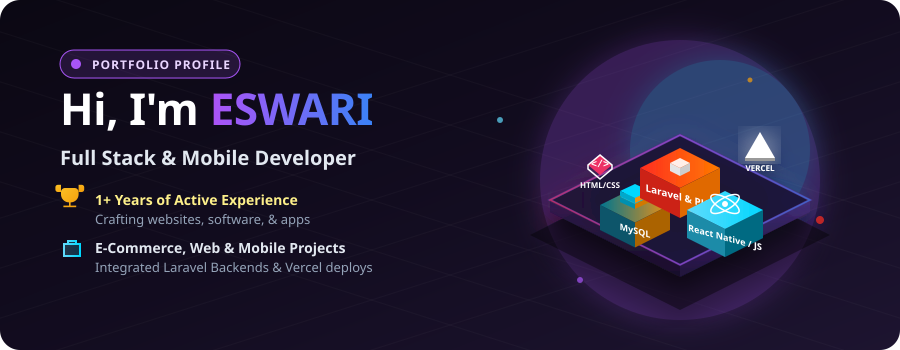

<div align="center">



</div>

<br/>

## About Me

I'm a developer who lives at the intersection of frontend and backend — I design the interface people see, and I build the system that powers it underneath.

- Frontend: I build interfaces with **HTML, CSS, JavaScript, and React**
- Backend: I build the logic and data layer with **Laravel, PHP, and MySQL**
- I care about clean code, fast load times, and interfaces that feel good to use
- Currently sharpening my React + Laravel workflow for full-stack projects



## What I Work With

<div align="center">

</div>


## Featured Work

| Project | Stack | Description |
|---|---|---|
| **Project One** | React, Laravel, MySQL | Short description of what it does and the problem it solves |
| **Project Two** | HTML, CSS, JS | Short description of what it does and the problem it solves |
| **Project Three** | Laravel, PHP, MySQL | Short description of what it does and the problem it solves |

> Replace this table with your real projects — link the repo name to the GitHub URL, e.g. `[Project One](https://github.com/your-username/project-one)`


## How I Work

```
Design in mind  →  Build the UI in React  →  Wire it to a Laravel API  →  Store it in MySQL  →  Ship it
```

## Let's Connect

- Email: your-email@example.com
- LinkedIn: linkedin.com/in/your-linkedin
- Portfolio: your-portfolio.com

<br/>
<div align="center">
<sub>Thanks for stopping by — feel free to explore my repositories below.</sub>
</div>
